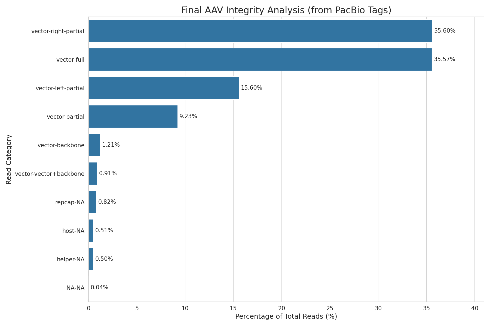

# AAV_genome_sequence_analysis
Analysis of PacBio AAV sequencing data using R and Python

# PacBio AAV Sequencing Data Analysis

## Project Overview
This project analyzes the genome integrity and purity of a public AAV sample using PacBio HiFi sequencing data. The analysis is performed using two different approaches to demonstrate workflow in both R and Python:
1.  **R Notebook (`AAV_Analysis_Report.Rmd`):** An analysis report created with R Markdown.
2.  **Jupyter Notebook (`AAV_Analysis.ipynb`):** An interactive analysis created with Python.

Both notebooks analyze the pre-processed `.tagged.bam` file from the dataset to extract official PacBio classifications and visualize the results.

## Final Results
This chart shows the percentage of different AAV vector species found in the sample, as classified by the official PacBio LAAVA pipeline software.



## Data Source
The data used in this analysis is the public PacBio "Revio ssAAV" dataset. The specific file required to run this analysis is not included in this repository due to its large size.

* **Required File:** `m84026_231030_220704_s3.tagged.bam`
* **Download from:** [https://downloads.pacbcloud.com/public/dataset/AAV/2023-Revio-ssAAV-pAV-CMF-GFP/rep1/1-output/](https://downloads.pacbcloud.com/public/dataset/AAV/2023-Revio-ssAAV-pAV-CMF-GFP/rep1/1-output/)

Please download the file and place it in the project's root directory to run the notebooks.

## Setup & How to Run
This analysis requires a Conda environment running within a Linux shell (e.g., WSL2).

1.  **Clone the repository:**
    ```bash
    git clone [https://github.com/SooryaChandra/AAV_genome_sequence_analysis.git](https://github.com/SooryaChandra/AAV_genome_sequence_analysis.git)
    cd AAV_genome_sequence_analysis
    ```
2.  **Create and activate the Conda environment for the Python notebook:**
    ```bash
    conda create --name aav_py python=3.9 -y
    conda activate aav_py
    conda install -c bioconda -c conda-forge pysam pandas seaborn matplotlib jupyterlab -y
    ```
3.  **Run the analysis:**
    * Open the `AAV_Analysis.ipynb` notebook in VS Code or Jupyter Lab.
    * Ensure you select the `aav_py` environment as the kernel and run the cells.
    * The R Notebook (`AAV_Analysis_Report.Rmd`) can be opened and run in RStudio.
